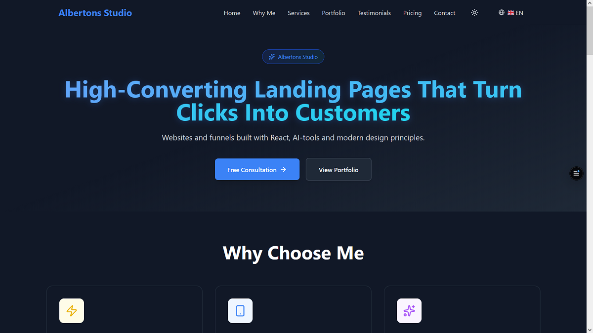

# 🚀 Albertons Studio - Portfolio

Professional portfolio website showcasing premium landing pages and web development services.



## ✨ Features

- 🌍 **Multilingual Support**: Available in 4 languages (Hungarian, English, German, Serbian)
- 📱 **Fully Responsive**: Optimized for all devices
- 🎨 **Modern Design**: Clean UI with blue gradient theme
- ⚡ **Fast Performance**: Built with Vite and optimized for speed
- 📧 **Working Contact Form**: Integrated with Web3Forms API
- 🖼️ **Portfolio Carousel**: Swiper.js image galleries for projects
- ♿ **Accessible**: WCAG compliant design
- 🔍 **SEO Optimized**: Meta tags, sitemap, robots.txt

## 🛠️ Tech Stack

- **Framework**: React 19 + TypeScript
- **Build Tool**: Vite 7.2.2
- **Styling**: Tailwind CSS 3.4.16
- **i18n**: react-i18next
- **Icons**: Lucide React
- **Carousel**: Swiper.js
- **Forms**: Web3Forms API
- **Deployment**: Vercel

## 🌐 Live Demo

Visit the live site: [albertons-portfolio.vercel.app](https://albertons-portfolio.vercel.app)

## 📂 Project Structure

```
albertons-portfolio/
├── src/
│   ├── components/
│   │   ├── Navbar.tsx
│   │   ├── Hero.tsx
│   │   ├── WhyChooseMe.tsx
│   │   ├── Services.tsx
│   │   ├── Portfolio.tsx
│   │   ├── Testimonials.tsx
│   │   ├── Pricing.tsx
│   │   ├── Contact.tsx
│   │   └── Footer.tsx
│   ├── locales/
│   │   ├── en.json
│   │   ├── hu.json
│   │   ├── de.json
│   │   └── sr.json
│   ├── i18n.ts
│   └── main.tsx
├── public/
│   ├── projects/
│   ├── robots.txt
│   └── sitemap.xml
└── package.json
```

## 🚀 Getting Started

### Prerequisites

- Node.js 18+ 
- npm or yarn

### Installation

```bash
# Clone the repository
git clone https://github.com/Albertons03/albertons-portfolio.git

# Navigate to project directory
cd albertons-portfolio

# Install dependencies
npm install

# Start development server
npm run dev
```

The site will be available at `http://localhost:5173`

### Build for Production

```bash
# Create production build
npm run build

# Preview production build
npm run preview
```

## 🎨 Featured Projects

1. **SmartFit Pro X** - Fitness landing page with modern animations
2. **Vienna Personal Trainer** - Multilingual personal training website
3. **Career Code Coach** - Professional career coaching platform

## 📧 Contact

- **Email**: johnwickk0868@gmail.com
- **WhatsApp**: +43 660 821 6865
- **LinkedIn**: [Albertons Juhasz](https://www.linkedin.com/in/albertons-juhasz-7053a4397/)
- **Instagram**: [@alberto.juhasz](https://www.instagram.com/alberto.juhasz/)
- **GitHub**: [@Albertons03](https://github.com/Albertons03)

## 📄 License

This project is open source and available under the [MIT License](LICENSE).

---

Made with ❤️ by Albertons Studio
